#


<hr>

## Table of Contents 

- [Overview](#overview)
- [Project Goal](#project-goal)
- [User Experience](#user-experience-ux)
  - [User Stories](#user-stories)
  - [Design](#design)
  - [Colour Scheme](#colour-scheme)
  - [Skeleton](#skeleton)
  - [Wireframes](#wireframes)
  - [Flowchart](#flowchart)
  - [Visual Effects](#visual-effects)
- [Features](#features)
  - [Visual Effects](#visual-effects)
  - [Home Page](#home-page)
  - [About Us Page](#about-us-page)
  - [Blogs Page](#blogs-page)
  - [Comments Page](#comments-page)
  - [Contact Page](#contact-page)
  - [Account Login](#account-login)
  - [Register](#register)
  - [Profile](#profile)
  - [Logout](#logout)
  - [Future Features](#future-features)
- [Agile Methodology](#agile-methodology)
  - [Responsive Layout and Design](#responsive-layout-and-design)
  - [Database](#database)
- [Testing](#testing)
  - [Testing User Stories](#testing-user-stories)
  - [Lighthouse](#lighthouse)
  - [HTML Validation](#html-validation)
  - [CSS Validation](#css-validation)
  - [Manual Testing](#manual-testing)
  - [Frontend](#frontend)
  - [Backend Admin Panel](#backend-admin-panel)
  - [Fixed Bugs](#fixed-bugs)
  - [Unfixed Bugs](#unfixed-bugs) 
- [Creating the Django app](#creating-the-django-app)
  - [Deployment of This Project](#deployment-of-this-project)
  - [Final Deployment](#final-deployment)
  - [Forking This Project](#forking-this-project)
  - [Cloning This Project](#cloning-this-project)
- [Credits](#credits)
  - [Acknowledgements](#acknowledgements)


## Overview

I love water sports, and kayaking is one of the best ways to immerse yourself in nature and escape from daily life. That's why I decided to create a kayaking blog, where fellow paddlers and I can share our experiences on the water. Check out our latest adventures and stories [live link](https://kayak-blog-pp4-1054055911f7.herokuapp.com/my-posts/) 

## Project Goal:

The goal is to build a community around kayaking, where we can share knowledge and insights to enhance everyone's experience of the sport.

**Project Objectives:**

* Provide people the opportunity to write about their kayaking experiences.
* Connect kayakers to kayakers is the idea so that we can find more information or just blog about our experiences and safty tips.
* Share ideas and create a community around kayaking so that the paddling experience can grow. 


[Back to Table of Contents](#table-of-contents)


# User Experience UX

**User Stories**

User stories can be viewed here on the project [kanban board ](https://github.com/users/Marceillo/projects/8/views/1)

| EPIC                               | ID | User Story                                                           |
| :--------------------------------- | -- | :------------------------------------------------------------------- |
| **User Authentication and Profiles**|    |                                                                      |
|                                     | 1.1| As a user, I can register and log in so that I can access the website.|             
|                                     | 1.2| As a user, I want to view and edit my profile.                        |
| **Core Blog Functionality**         |    |                                                                      | 
|                                     | 2.1| As a user, I want to search for specific kayaking topics.             |
|                                     | 2.2| As a content creator, I can write blog posts so that it is published. |
|                                     | 2.3| As a user, I want to read blog posts about kayaking experiences.      |
| **User Interaction and Engagement**                           |    |                                            |
|                                     | 3.1 |As a user, I want to comment on blog posts. |
|                                     | 3.2 | As a user, I want to like blog posts. |
|                                     | 3.3 |As a user, I want to favorite blog posts to find them later easily.  |
| **Core Blog Functionality**                        |    |                                                       |
|                                     | 4.1 | As a content creator, I want to upload for **images for my blog posts.|
|                                     | 4.2 | As a user, I want to search for specific kayaking topics.           |
|                                     | 4.3 | As a content creator, I can write blog posts so that it is published.|
| **Admin Functionality**             |     |                                                                     |
|                                     | 5.1 | As an admin, I want to manage users and content through the admin panel. |
| **EPIC: Mobile Responsiveness and UI/UX**|    |                                                                 |
|                                     | 6.1 | As a user, I want to view the website on my mobile device.          |
|                                     | 6.1 | As a user, I want to view the website on my Focus on testing all implemented features.          |
|**Focus on testing all implemented features**.| 


[Back to Table of Contents](#table-of-contents)


# Design

## Colours

* I used colors to match the background src="static /videos/oceanbgvideo.mp4" type="video/mp4"


### Colour Scheme

* The color was based on the video image below.
<br>
<video width="40%" height="200" controls>
  <source src="static/videos/oceanbgvideo.mp4" type="video/mp4">
  Your browser does not support the video tag.
</video>

* Used a [Coolors web site](https://coolors.co/palettes/trendin) to search for colors that match.

* The secondary colour scheme was used for buttons, warnings, errors or for highlighting important information.

[Back to Table of Contents](#table-of-contents)

#### Typography

* The Roboto font as the main and Lato as the secondary font for the whole project.

[Back to Table of Contents](#table-of-contents)

#### Imagery

* Used wireframes and lucid at the initial start and updated them as needed when changes where made .

# Skeleton

## Wireframes

The wireframes for mobile and desktop were created with [Balsamiq](lucidchart.com)
<br>
<details>
  <summary>Wire Frames</summary>
  <h4>Home page</h4>
  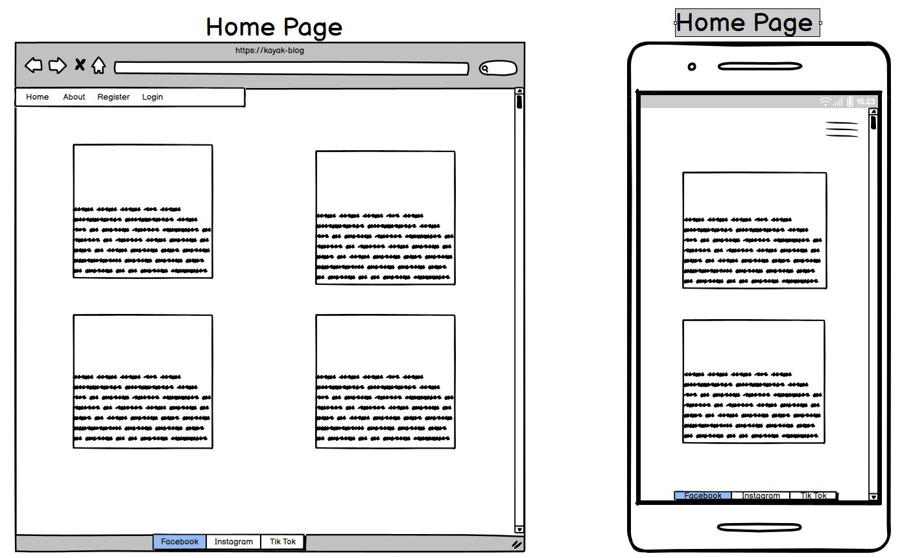<br>
  <h4>Home after signed in page</h4>
  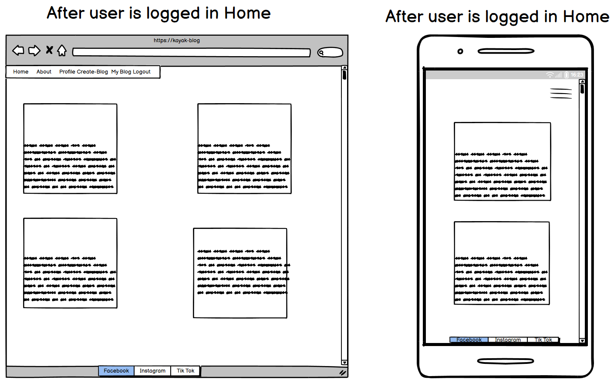<br>
  <h4>Create Blog page link only when logged in</h4>
  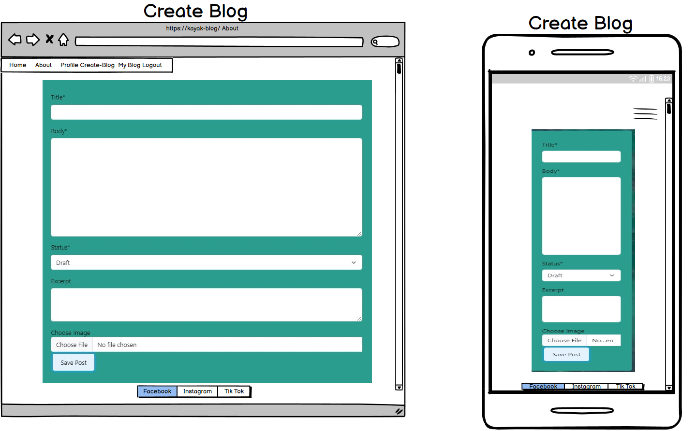<br>
  <h4>My Blog page link only when logged in</h4>
  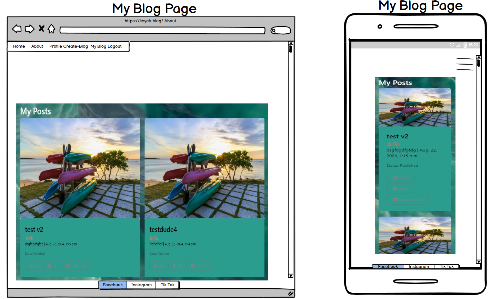<br>
  <h4>Profile page link only when logged in</h4>
  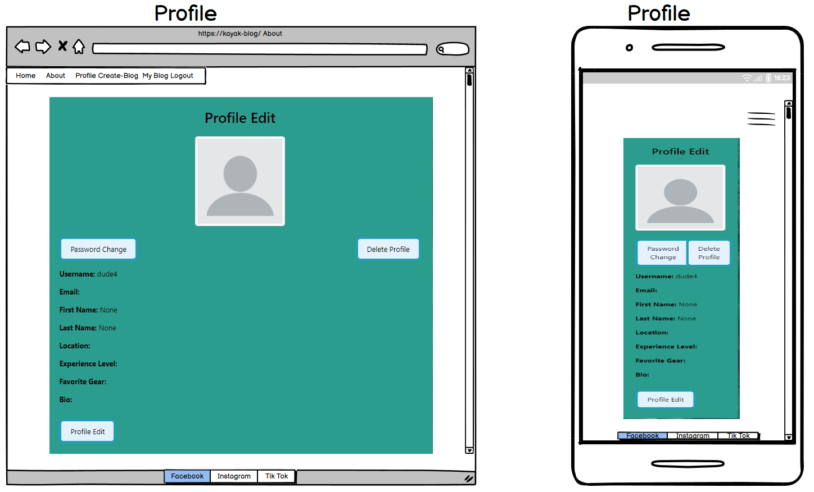<br>
  <h4>MY Profile edit page link only when logged in</h4>
  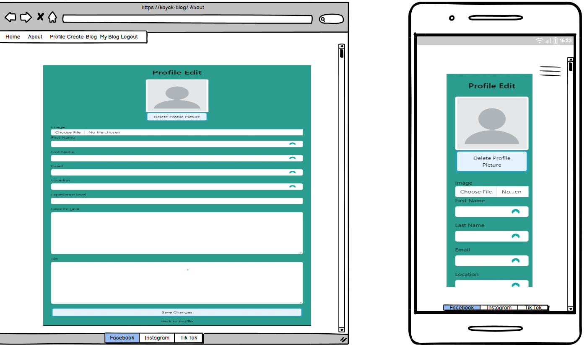<br>
  <h4>About page</h4>
  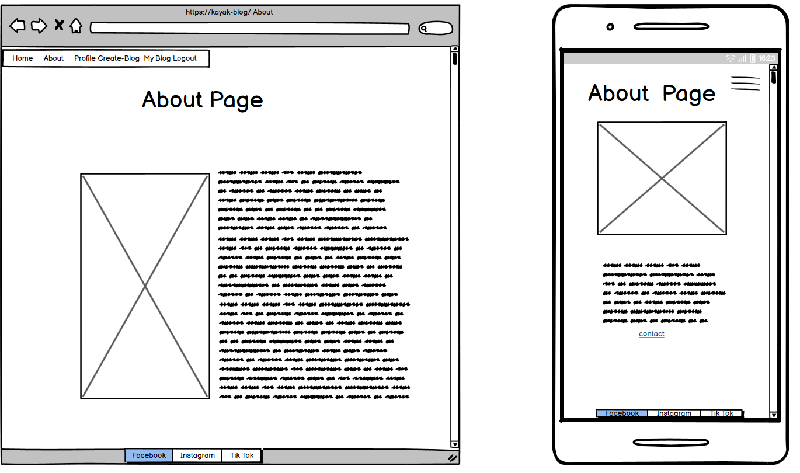<br>
  <h4>About contact page</h4>
  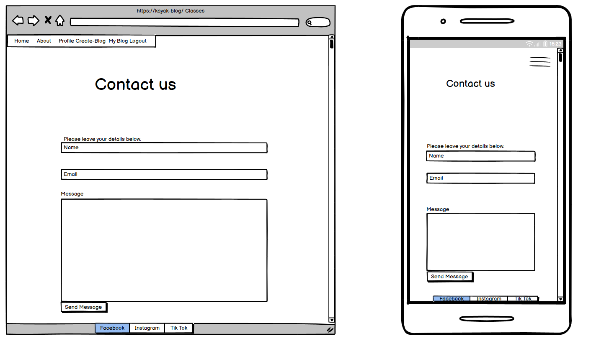<br>
  <h4>Register page </h4>
  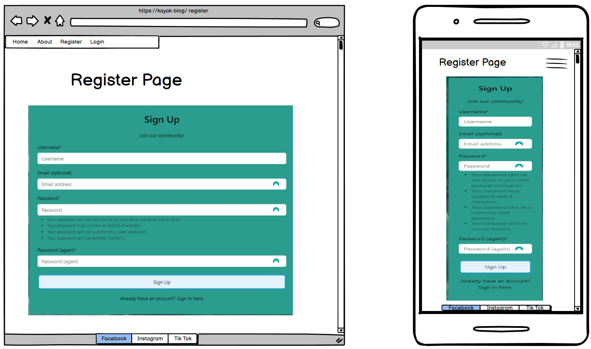<br>
  <h4>Login</h4>
  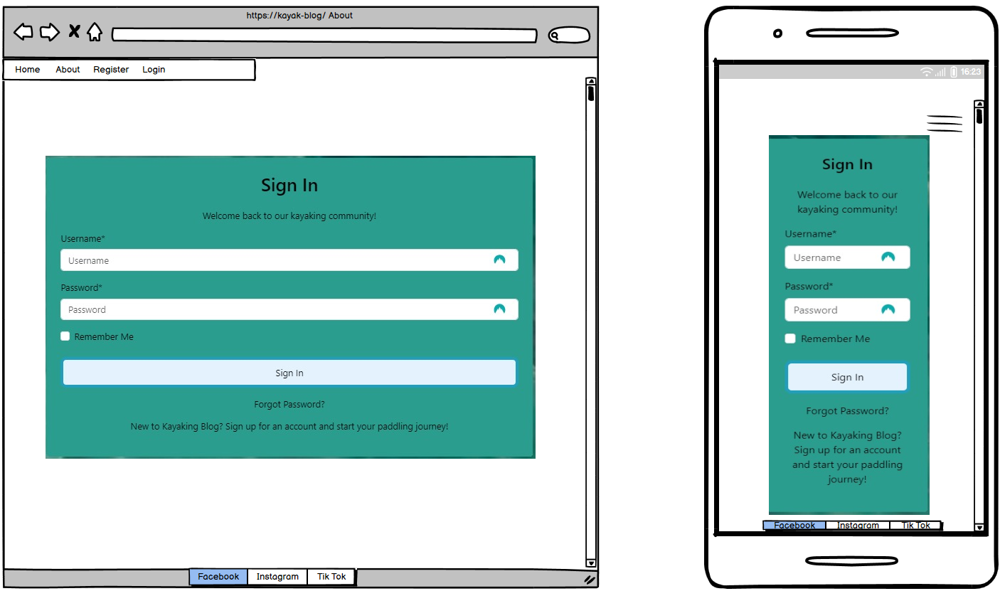<br>
  <h4>Signout</h4>
  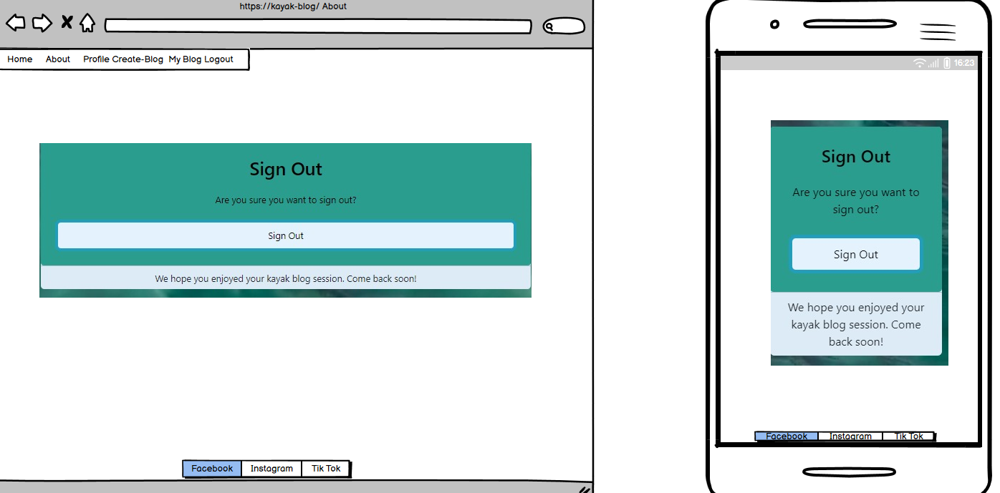<br>
</details>

<br>

[Back to Table of Contents](#table-of-contents)

## Intial ERD Diagram

<details>
<summary>My Intial ERD Diagram</summary>
The intial ERD diagram plan I used [lucid chart](https://www.lucidchart.com/)
<br>
<br>
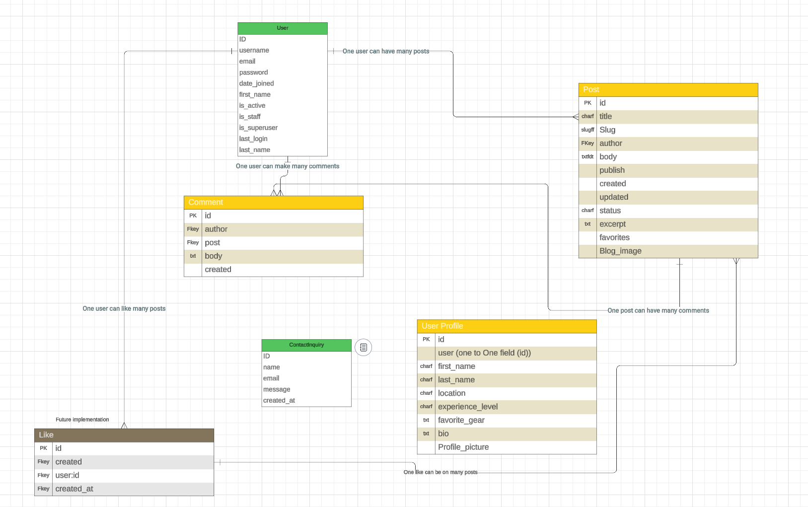
<br>
<br>
</details>

## Django ERD Diagram
<details>
<summary>Used Django to create a ERD Diagram</summary>
Django has built in tool that can show you your ERD diagram .

* steps to using this is to install django-extensions.
* Step2 would be to add it the installed apps.
* Step3 would be to add it to the requirements file.
* Step4 is to run the python manage.py graph_models -a --output erd.dot 
* Step5 After this it will create erd.dot file with all the applications models data.
* step6 Put the data in this software to change to a image file much like the one I used below.

The erd dot file convert to image [Graphviz online](https://dreampuf.github.io/GraphvizOnline/#digraph%20G%20%7B%0A%0A%20%20subgraph%20cluster_0%20%7B%0A%20%20%20%20style%3Dfilled%3B%0A%20%20%20%20color%3Dlightgrey%3B%0A%20%20%20%20node%20%5Bstyle%3Dfilled%2Ccolor%3Dwhite%5D%3B%0A%20%20%20%20a0%20-%3E%20a1%20-%3E%20a2%20-%3E%20a3%3B%0A%20%20%20%20label%20%3D%20%22process%20%231%22%3B%0A%20%20%7D%0A%0A%20%20subgraph%20cluster_1%20%7B%0A%20%20%20%20node%20%5Bstyle%3Dfilled%5D%3B%0A%20%20%20%20b0%20-%3E%20b1%20-%3E%20b2%20-%3E%20b3%3B%0A%20%20%20%20label%20%3D%20%22process%20%232%22%3B%0A%20%20%20%20color%3Dblue%0A%20%20%7D%0A%20%20start%20-%3E%20a0%3B%0A%20%20start%20-%3E%20b0%3B%0A%20%20a1%20-%3E%20b3%3B%0A%20%20b2%20-%3E%20a3%3B%0A%20%20a3%20-%3E%20a0%3B%0A%20%20a3%20-%3E%20end%3B%0A%20%20b3%20-%3E%20end%3B%0A%0A%20%20start%20%5Bshape%3DMdiamond%5D%3B%0A%20%20end%20%5Bshape%3DMsquare%5D%3B%0A%7D)
<br>
<br>
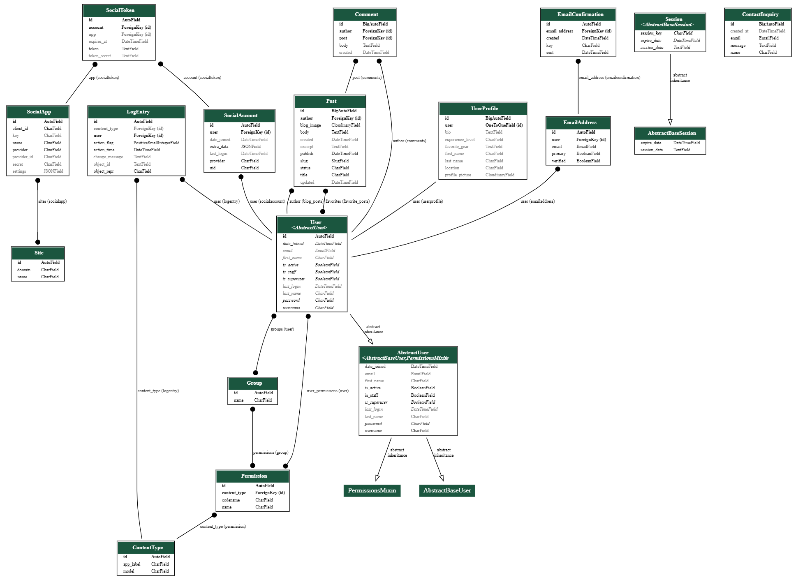<br>

## Credit below for the above detailed ERD diagram.

[You Tube link](https://www.youtube.com/watch?v=qzrE7cfc_3Q&t=357s)

[django-extensions](https://django-extensions.readthedocs.io/en/latest/graph_models.html)
</details>

## Visual Effects

* 

## Features

### Home Page


* The hero image

### About Us Page


* Note:

[Back to Table of Contents](#table-of-contents)

### Blogs Page


* Note:

[Back to Table of Contents](#table-of-contents)

### Comments Page


* Note:

[Back to Table of Contents](#table-of-contents)

* 

[Back to Table of Contents](#table-of-contents)


* 

[Back to Table of Contents](#table-of-contents)

### Contact Page


* 
[Back to Table of Contents](#table-of-contents)

### Account login


* 
[Back to Table of Contents](#table-of-contents)

### Register


* 

[Back to Table of Contents](#table-of-contents)

### Profile


* The profile page allows the user to add an image as well as edit their profile picture, username or email address.

[Back to Table of Contents](#table-of-contents)

### Logout


* 

[Back to Table of Contents](#table-of-contents)

### Future Features

* 

[Back to Table of Contents](#table-of-contents)

## Database

The project uses the PostgreSQL relational database for storing the data.

## Agile Methodology
This project was developed using the Agile methodology.<br>
All epics and user stories implementation progress was registered using [Github issues](https://github.com/hughes84/my-blog-pp4/issues). As the user stories were accomplished, they were moved in the Kanban Board from **Epic**,**User stories**, **To Do**, to **In-progress**, **Testing** and **Done** lists. 

## Responsive Layout and Design
The project design has been adapted to all types of devices using Bootstrap predefined breakpoints. For intermediate devices where the design didn't fit accordingly, custom breakpoints were used.

**Breakpoints:**
    - max-width:575.98px
    - max-width:991.98px
    - max-width:1300.98px

[Back to Table of Contents](#table-of-contents)

## Tools Used

[GitHub](https://github.com/) - used for hosting the source code of the program<br>
[Heroku](https://dashboard.heroku.com/) - used for deploying the project<br>
[Favicon.io](https://favicon.io/) - used for generating the website favicon<br>
[Font Awesome](https://fontawesome.com/) - for creating atractive UX with icons<br>
[Bootstrap5](https://getbootstrap.com/) - for adding predifined styled elements and creating responsiveness<br>
[Google Fonts](https://fonts.google.com/) - for typography<br>
[JsHint](https://jshint.com/) - used for validating the javascript code<br>
[PEP8 Validator](http://pep8online.com/) - used for validating the python code<br>
[HTML - W3C HTML Validator](https://validator.w3.org/#validate_by_uri+with_options) - used for validating the HTML<br>
[CSS - Jigsaw CSS Validator](https://jigsaw.w3.org/css-validator/#validate_by_uri) - used for validating the CSS<br>
[GraphvizOnline](https://dreampuf.github.io/GraphvizOnline/#digraaph%20G%20%7B%0A%0A%20%20subgraph%20cluster_0%20%7B%0A%20%20%20%20style%3Dfilled%3B%0A%20%20%20%20color%3Dlightgrey%3B%0A%20%20%20%20node%20%5Bstyle%3Dfilled%2Ccolor%3Dwhite%5D%3B%0A%20%20%20%20a0%20-%3E%20a1%20-%3E%20a2%20-%3E%20a3%3B%0A%20%20%20%20label%20%3D%20%22process%20%231%22%3B%0A%20%20%7D%0A%0A%20%20subgraph%20cluster_1%20%7B%0A%20%20%20%20node%20%5Bstyle%3Dfilled%5D%3B%0A%20%20%20%20b0%20-%3E%20b1%20-%3E%20b2%20-%3E%20b3%3B%0A%20%20%20%20label%20%3D%20%22process%20%232%22%3B%0A%20%20%20%20color%3Dblue%0A%20%20%7D%0A%20%20start%20-%3E%20a0%3B%0A%20%20start%20-%3E%20b0%3B%0A%20%20a1%20-%3E%20b3%3B%0A%20%20b2%20-%3E%20a3%3B%0A%20%20a3%20-%3E%20a0%3B%0A%20%20a3%20-%3E%20end%3B%0A%20%20b3%20-%3E%20end%3B%0A%0A%20%20start%20%5Bshape%3DMdiamond%5D%3B%0A%20%20end%20%5Bshape%3DMsquare%5D%3B%0A%7D) - To take erd.dot file and convert to a graph<br>
LightHouse - for testing performance<br>

[Back to Table of Contents](#table-of-contents)

# Testing

* Testing has taken place continuously throughout the development of the project. Each view 
  was tested regularly. 
 
## Testing User Stories

* 

### Python Validation - PEP8

* 


## Lighthouse
Lighthouse 


[Back to Table of Contents](#table-of-contents)

## HTML Validation


## CSS Validation
* Custom CSS was validated using W3C Jigsaw validation service. No were displayed.


[Back to Table of Contents](#table-of-contents)

## Manual Testing
### Frontend
* 
[Back to Table of Contents](#table-of-contents)

### Backend Admin Panel
* 

[Back to Table of Contents](#table-of-contents)

- All manual testing was done with DEBUG = False in the settings.py file.g


* **All known bugs have been fixed**

## Fixed bugs

| **Bug** | **Fix** |
| --- | --- |
| Bug1: Heroku log= Mis-cased procfile detected; ignoring. to Heruko | Rename it to Procfile to have it honored as it is case sensitive |
| Bug2: deployment was an error on the Heroku app =Bad Request (400). | I forgot to add the Heruko site to the allowed hosts.
| Bug3: Forbidden (403)CSRF verification failed. Request aborted. | Added Heroku to the  CSRF_TRUSTED_ORIGINS in settings 
| Bug4: The model Post is already registered in app blog. |  Removed the duplicate admin.register(post)
| Bug5: The drop-down list in the Django admin app was showing the ID and not the author's name. | Removed this incorrect code I created raw_id_fields = ['author',] which returned it to its stock feature a drop down list.
| Bug6: admin.E108 The value of 'list_display[1]' refers to 'first-name', which is not a callable, an attribute of 'UserProfileAdmin', or an attribute or method on 'blog.UserProfile'. | changed the code from first-name to first_name as per my code.
| Bug7: RelatedObjectDoesNotExist at /accounts/login/User has no userprofile.Exception Type:	RelatedObjectDoesNotExist | Accessed the manage.py shell and imported the UserProfile, testing after with the shell.Reason the model was changed and not synced with the database.
| Bug: 


[Back to Table of Contents](#table-of-contents)

## Unfixed Bugs 

| **Bug** | **UNfixed** | **Why**|  
| ---     | ---         |---     |
| test    | dsdds       | xcxc   |

## Creating the Django app hello

1. Go to the Code Institute Gitpod Full Template [Template](https://github.com/Code-Institute-Org/gitpod-full-template)
2. Click on Use This Template
3. Once the template is available in your repository click on Gitpod
4. When the image for the template and the Gitpod are ready open a new terminal to start a new Django App
5. Install Django and gunicorn: `pip3 install django gunicorn`
6. Install supporting database libraries dj_database_url and psycopg2 library: `pip3 install dj_database_url psycopg2`
7. Create file for requirements: in the terminal window type `pip freeze --local > requirements.txt`
8. Create project: in the terminal window type django-admin startproject your_project_name
9. Create app: in the terminal window type python3 manage.py startapp your_app_name
10. Add app to the list of installed apps in settings.py file: you_app_name
11. Migrate changes: in the terminal window type python3 manage.py migrate
12. Run the server to test if the app is installed, in the terminal window type python3 manage.py runserver
13. If the app has been installed correctly the window will display The install worked successfully! Congratulations!

[Back to Table of Contents](#table-of-contents)

## Deployment of This Project

* This site was deployed by completing the following steps:

1. Log in to [Heroku](https://id.heroku.com) or create an account
2. On the main page click the button labelled New in the top right corner and from the drop-down menu select Create New
App
3. You must enter a unique app name
4. Next select your region
5. Click on the Create App button
6. Click in resources and select Heroku Postgres database
7. Click Reveal Config Vars and add a new record with SECRET_KEY
8. Click Reveal Config Vars and add a new record with the `CLOUDINARY_URL`
9. Click Reveal Config Vars and add a new record with the `DISABLE_COLLECTSTATIC = 1`
10. The next page is the project’s Deploy Tab. Click on the Settings Tab and scroll down to Config Vars
11. Next, scroll down to the Buildpack section click Add Buildpack select python and click Save Changes
12. Scroll to the top of the page and choose the Deploy tab
13. Select Github as the deployment method
14. Confirm you want to connect to GitHub
15. Search for the repository name and click the connect button
16. Scroll to the bottom of the deploy page and select the preferred deployment type
17. Click either Enable Automatic Deploys for automatic deployment when you push updates to Github

[Back to Table of Contents](#table-of-contents)

## Final Deployment 

1. Create a runtime.txt `python-3.8.13`
2. Create a Procfile `web: gunicorn your_project_name.wsgi`
3. When development is complete change the debug setting to: `DEBUG = False` in settings.py
4. In this project the summernote editor was used so for this to work in Heroku add: `X_FRAME_OPTIONS = SAMEORIGIN `to
   settings.py.
5. In Heroku settings, delete the config vars for `DISABLE_COLLECTSTATIC = 1`

[Back to Table of Contents](#table-of-contents)

## Forking This Project

* Fork this project by following the steps:

1. Open [GitHub](https://github.com/hughes84/my-blog-pp4.git)
2. Find the 'Fork' button at the top right of the page
3. Once you click the button the fork will be in your repository

## Cloning This Project

* Clone this project by following the steps:

1. Open [GitHub](https://github.com/hughes84/my-blog-pp4.git)
2. You will be provided with three options to choose from, HTTPS, SSH or GitHub CLI, click the clipboard icon in order
to copy the URL
3. Once you click the button the fork will be in your repository
4. Open a new terminal
5. Change the current working directory to the location that you want the cloned directory
6. Type 'git clone' and paste the URL copied in step 3
7. Press 'Enter' and the project is cloned

[Back to Table of Contents](#table-of-contents)

To clone and set up this project you need to follow the steps below.

1. When you are in the repository, find the code tab and click it.
2. To the left of the green GitPod button, press the 'code' menu. There you will find a link to the repository. Click on the clipboard icon to copy the URL.
3. Use an IDE and open Git Bash. Change directory to the location where you want the cloned directory to be made.
4. Type 'git clone', and then paste the URL that you copied from GitHub. Press enter and a local clone will be created.

<details><summary><b>Github Create Local Clone</b></summary>


</details><br />

5. To be able to get the project to work you need to install the requirements. This can be done by using the command below:

* ```pip3 install -r requirements.txt``` - This command downloads and install all required dependencies that is stated in the requirements file.

6. The next step is to set up the environment file so that the project knows what variables that needs to be used for it to work. Environment variables are usually hidden due to sensitive information. It's very important that you don't push the env.py file to Github (this can be secured by adding env.py to the .gitignore-file). The variables that are declared in the env.py file needs to be added to the Heroku config vars. Don't forget to do necessary migrations before trying to run the server.

* ```python3 manage.py migrate``` - This will do the necessary migrations.
* ```python3 manage.py runserver``` - If everything i setup correctly the project is now live locally.

<details><summary><b>Setup env.py</b></summary>


</details><br />

[Back to top](<#table-of-content>)

## Credits
* [django-extensions](https://django-extensions.readthedocs.io/en/latest/graph_models.html)
* [Coolors web site](https://coolors.co/palettes/trendin)

### Content

* [You Tube Graph Models](https://www.youtube.com/watch?v=qzrE7cfc_3Q&t=357s)


## Acknowledgements

* 
[Back to Table of Contents](#table-of-contents)
